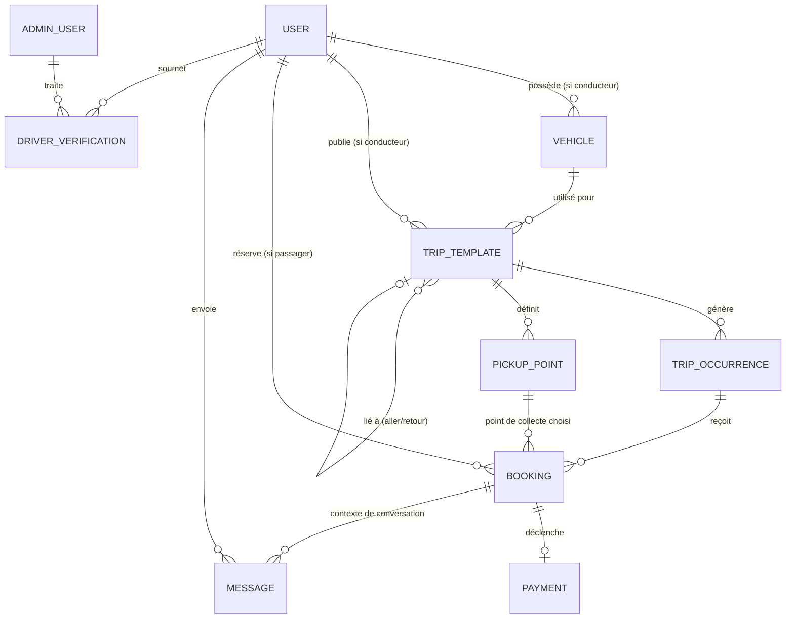

# Spécification Fonctionnelle — WTS Covoiturage (MVP)

**Filiale de World Tedungal Services (WTS)**
**Statut :** Document de travail — v0.1
**Date :** 21 juillet 2026
**Auteur :** Demba THIAM, Directeur Général WTS
**Zone de service :** Dakar (Sénégal) uniquement

> Le nom "WTS Covoiturage" est utilisé comme nom de travail dans ce document. Le nom de marque final reste une décision à trancher (voir section 7).

---

## 1. Vue d'ensemble et objectifs du produit

### 1.1 Contexte

WTS est une agence de voyage IATA basée à Dakar. Ce nouveau produit est une application mobile de covoiturage **planifié** (à ne pas confondre avec un service de VTC à la demande type Uber/Yango). Elle s'appuie sur des conducteurs propriétaires de véhicules qui publient à l'avance des trajets récurrents ou ponctuels, avec des points de collecte et des horaires fixes, sur lesquels des passagers réservent une place.

### 1.2 Proposition de valeur

- **Pour les conducteurs** : monétiser un trajet qu'ils font déjà (domicile-travail typiquement), en partageant les frais avec des passagers réguliers, sans les contraintes d'un chauffeur VTC (pas de courses à la demande, horaires et itinéraire fixés par eux-mêmes).
- **Pour les passagers** : un trajet fiable, prévisible et moins cher qu'un taxi/VTC, avec des horaires et points de collecte connus à l'avance — utile notamment pour les trajets domicile-travail récurrents.
- **Pour WTS** : diversification de l'activité, nouvelle source de revenus (commission sur transaction), et cohérence avec le cœur de métier (mobilité).

### 1.3 Objectifs du MVP

1. Permettre à un conducteur de publier un trajet (aller et/ou retour), récurrent ou ponctuel, avec points de collecte et horaires.
2. Permettre à un passager de trouver ce trajet, réserver une place et payer in-app.
3. Permettre une communication minimale mais suffisante entre conducteur et passager avant le trajet.
4. Garantir la fiabilité des données de disponibilité (pas de surbooking) et la traçabilité des paiements.

### 1.4 Ce qui est explicitement hors périmètre du MVP

- Matching dynamique / temps réel (type VTC) — **exclu par nature du produit**.
- Paiement cash in-app (le cash peut exister hors app mais n'est pas géré comme flux officiel au MVP — à trancher, voir section 7).
- Système de notation/avis passager ↔ conducteur (recommandé pour V2).
- Programme de fidélité / abonnements.
- Zones hors Dakar.
- Version web / PWA.
- Covoiturage "instantané" ou trajets ad hoc sans publication préalable.

### 1.5 Zone de service

Dakar et sa banlieue proche (à délimiter précisément — périmètre administratif de Dakar, ou zone géographique incluant Pikine/Guédiawaye/Rufisque ? **Décision à trancher**, voir section 7). Cette délimitation contraint :
- Les points de collecte proposés (autocomplete Google Places restreint à la zone).
- La validation d'adresse conducteur/passager à l'inscription.

---

## 2. Profils utilisateurs et parcours

Trois profils : **Conducteur**, **Passager**, **Admin WTS**. Un même compte utilisateur peut techniquement cumuler conducteur et passager (ex. un conducteur qui prend aussi le trajet retour d'un collègue), mais l'activation du profil conducteur nécessite une vérification dédiée.

### 2.1 Profil Conducteur

**Prérequis pour publier un trajet** : compte vérifié (identité + permis + véhicule), voir 2.1.1.

#### 2.1.1 Parcours d'inscription et vérification conducteur

1. Inscription (téléphone + OTP via Supabase Auth).
2. Complétion du profil : nom, prénom, photo, email (optionnel).
3. Déclaration "Je veux publier des trajets en tant que conducteur".
4. Upload des documents :
   - Pièce d'identité (CNI/passeport).
   - Permis de conduire (recto/verso).
   - Carte grise du véhicule.
   - Assurance véhicule en cours de validité.
   - Photo du véhicule.
5. Saisie des infos véhicule : marque, modèle, couleur, immatriculation, nombre de places passagers disponibles.
6. Statut du compte conducteur = **"En attente de vérification"**.
7. Un admin WTS valide ou rejette (voir 2.3). Notification push/SMS au conducteur du résultat.
8. Une fois **"Vérifié"**, le conducteur peut publier des trajets.

*Règle de gestion* : un conducteur non vérifié peut naviguer dans l'app mais l'action "Publier un trajet" est bloquée avec un message explicite et un lien vers le statut de vérification.

#### 2.1.2 Parcours de publication d'un trajet

1. Le conducteur choisit : trajet **Aller simple**, **Retour simple**, ou **Aller + Retour** (créés comme deux trajets liés, voir modèle de données).
2. Il définit le type de trajet : **Récurrent** (ex. lundi-vendredi) ou **Ponctuel** (une date précise).
3. Il définit les points de collecte : un point de départ, des points intermédiaires optionnels (max N à définir, ex. 3), un point d'arrivée — via recherche Google Places restreinte à Dakar.
4. Il définit l'horaire de passage à chaque point (heure de passage estimée, avec le premier point comme référence).
5. Il définit le nombre de places disponibles (contraint par la capacité déclarée du véhicule).
6. Il définit le prix par place (par trajet, potentiellement différent par point de collecte si la distance varie — **à trancher**, voir section 7).
7. Il définit, si récurrent, la période de validité (date de début, date de fin optionnelle) et les jours de la semaine concernés.
8. Récapitulatif et publication. Le trajet passe en statut **"Publié"** et devient visible/réservable par les passagers.

*Règle de gestion — trajet récurrent* : la publication d'un trajet récurrent génère des **occurrences** (une par date/jour concerné) sur un horizon glissant (ex. 4 semaines à l'avance, régénérées automatiquement). Chaque occurrence a son propre compteur de places disponibles, indépendant des autres occurrences.

*Règle de gestion — exception dans une récurrence* : le conducteur peut annuler une occurrence spécifique (ex. jour férié, indisponibilité ponctuelle) sans annuler toute la série. Les passagers déjà réservés sur cette occurrence sont notifiés et remboursés (voir 3.1.4).

#### 2.1.3 Parcours de gestion des réservations reçues

1. Le conducteur consulte, pour chaque occurrence de trajet à venir, la liste des passagers ayant réservé (nom, point de collecte, nombre de places).
2. Il peut contacter un passager via la messagerie interne.
3. Il peut annuler une occurrence de trajet (voir règles 3.1.4).
4. Après le trajet, l'occurrence passe automatiquement (ou manuellement) en statut **"Terminé"**, ce qui déclenche le versement au conducteur (voir 3.2).

### 2.2 Profil Passager

#### 2.2.1 Parcours d'inscription

1. Inscription (téléphone + OTP via Supabase Auth).
2. Complétion du profil : nom, prénom, photo (optionnelle), email (optionnel).
3. Pas de vérification documentaire obligatoire pour un passager au MVP (**à trancher** — un niveau minimal, ex. vérification du numéro de téléphone, est déjà couvert par l'OTP).

#### 2.2.2 Parcours de recherche et réservation

1. Le passager saisit un point de départ et une destination (ou choisit parmi ses trajets favoris/récents), et une date (ou "tous les jours ouvrés" pour filtrer les récurrents).
2. L'app affiche la liste des trajets/occurrences correspondants : horaire, conducteur (nom, note si dispo en V2, véhicule), point de collecte le plus proche, prix, places restantes.
3. Le passager sélectionne un trajet, choisit son point de collecte parmi ceux proposés par le conducteur (le passager **ne peut pas** créer un point de collecte personnalisé — les points sont fixés par le conducteur), et le nombre de places à réserver.
4. Si le trajet est récurrent, le passager peut réserver :
   - une occurrence unique, ou
   - un abonnement sur plusieurs occurrences (ex. toute la semaine, ou "tous les jours jusqu'au [date]") — chaque occurrence réservée reste un enregistrement de réservation distinct pour la gestion des places et des paiements.
5. Récapitulatif (trajet, point de collecte, horaire, prix total) → passage au paiement (PayTech).
6. Paiement confirmé → réservation passe en statut **"Confirmée"**, une place est décrémentée du compteur de disponibilité de l'occurrence, la messagerie avec le conducteur s'active.
7. Notification de confirmation (push + éventuellement SMS) avec récapitulatif.

*Règle de gestion — concurrence* : la décrémentation du compteur de places doit être atomique (transaction/verrou au niveau base de données) pour éviter le surbooking en cas de réservations simultanées sur la dernière place. Le paiement n'est déclenché qu'après réservation provisoire de la place (place "réservée temporairement" pendant le paiement, avec expiration si le paiement n'aboutit pas sous X minutes — ex. 10 min — pour libérer la place).

#### 2.2.3 Parcours d'annulation par le passager

Voir règles précises en 3.1.4.

#### 2.2.4 Parcours de messagerie

Le passager peut échanger avec le conducteur dès que la réservation est confirmée (voir 3.3).

### 2.3 Profil Admin WTS

1. **Vérification des conducteurs** : consulter les documents uploadés, approuver ou rejeter (avec motif), éventuellement demander un complément.
2. **Vérification/suivi des véhicules** : cohérence carte grise ↔ immatriculation déclarée, validité de l'assurance (à revalider périodiquement — expiration à surveiller).
3. **Supervision des trajets publiés** : possibilité de dépublier un trajet en cas de signalement/abus.
4. **Gestion des litiges** : consulter l'historique d'une réservation (paiement, messages, statut) pour arbitrer un différend conducteur/passager.
5. **Supervision des paiements** : vue sur les transactions PayTech, les commissions perçues, les versements aux conducteurs, les remboursements.
6. **Gestion des utilisateurs** : suspension/bannissement d'un compte en cas d'abus.
7. **Tableau de bord** : indicateurs clés (nombre de trajets publiés, taux de remplissage, GMV, commission WTS, nouveaux conducteurs en attente de vérification, litiges ouverts).

*Note technique* : l'interface Admin n'est pas nécessairement une app mobile — un back-office web (ex. dashboard interne) est probablement plus adapté pour ce profil, même si le produit final grand public est mobile-only. **À confirmer avec vous** : souhaitez-vous un back-office web séparé, ou une app mobile Admin ?

---

## 3. Détail des fonctionnalités MVP

### 3.1 Réservation de place sur un trajet (aller et/ou retour)

#### 3.1.1 Structure d'un trajet

- Un **trajet** (`trip_template` dans le modèle de données) définit : conducteur, véhicule, points de collecte ordonnés avec horaire de passage à chacun, prix par place, nombre de places, type (aller/retour — les deux sens sont deux trajets distincts, éventuellement liés par un `linked_trip_id` pour affichage groupé), récurrence ou non.
- Chaque trajet génère une ou plusieurs **occurrences** (`trip_occurrence`) — une occurrence = une instance datée et réservable du trajet, avec son propre compteur de places disponibles et son propre statut (Planifiée / Terminée / Annulée).
- Un trajet **ponctuel** génère une seule occurrence.
- Un trajet **récurrent** génère une occurrence par date correspondant aux jours de la semaine sélectionnés, sur un horizon glissant.

#### 3.1.2 Points de collecte

- Définis exclusivement par le conducteur à la création du trajet (adresse + coordonnées GPS via Google Places).
- Ordonnés (séquence de passage), chacun avec une heure de passage estimée.
- Un passager choisit, parmi les points définis, celui où il sera pris en charge (et, pour la destination, un point de dépose parmi les points définis après son point de collecte, ou le terminus).
- Les points de collecte peuvent être réutilisés d'un trajet à l'autre par le même conducteur (bibliothèque de points fréquents, confort UX — pas obligatoire au MVP mais recommandé).

#### 3.1.3 Réservation et gestion des places disponibles

- Une réservation porte sur **une occurrence précise** d'un trajet, un point de collecte, un point de dépose, et un nombre de places (1 par défaut, plusieurs si le passager réserve pour un accompagnant).
- Le compteur `places_disponibles` de l'occurrence est décrémenté à la réservation (après confirmation de paiement) et incrémenté en cas d'annulation valide.
- Une occurrence dont `places_disponibles = 0` n'est plus proposée à la réservation (affichée "Complet").
- Statuts d'une réservation : `En attente de paiement` → `Confirmée` → (`Terminée` | `Annulée par passager` | `Annulée par conducteur` | `No-show`).

#### 3.1.4 Règles d'annulation

**Annulation par le passager :**
- Annulation **libre et remboursée à 100%** si effectuée avant un délai limite avant le départ (ex. **H-4h** — seuil exact à trancher, voir section 7).
- Annulation **tardive** (après ce délai) : remboursement partiel ou nul selon la politique retenue (**à trancher**).
- La place redevient disponible immédiatement pour d'autres passagers dès l'annulation confirmée.
- Le conducteur est notifié de l'annulation.

**Annulation par le conducteur (d'une occurrence) :**
- Remboursement **intégral et automatique** de tous les passagers déjà réservés sur cette occurrence, quel que soit le délai.
- Notification immédiate (push + SMS) à tous les passagers concernés.
- Une annulation tardive et/ou répétée par un conducteur doit être tracée (compteur d'annulations) pour alimenter un futur système de fiabilité/notation, et peut déclencher une alerte admin en cas d'abus répété.
- Cas particulier trajet récurrent : le conducteur annule une **occurrence** sans affecter les occurrences suivantes de la série, sauf s'il choisit explicitement de mettre fin à la série entière (auquel cas toutes les occurrences futures non encore passées sont annulées et remboursées).

**No-show (passager absent au point de collecte) :**
- Le conducteur peut marquer la réservation comme "No-show" depuis l'app le jour du trajet.
- Pas de remboursement dans ce cas (le trajet a eu lieu, la place était réservée).
- **À trancher** : faut-il un mécanisme de contestation passager (ex. le conducteur n'est pas passé à l'heure) ? Recommandé pour éviter les abus, via un signalement traité par l'admin.

**No-show conducteur (conducteur absent) :**
- Le passager peut signaler l'incident depuis l'app.
- Remboursement intégral automatique après signalement (ou après examen admin — **à trancher** selon le niveau de confiance souhaité dans le signalement automatique).

#### 3.1.5 Trajet aller + retour

- Le passager peut réserver l'aller et le retour indépendamment (ce sont deux occurrences de deux trajets distincts, potentiellement chez le même conducteur si celui-ci propose les deux sens).
- L'UX doit permettre, si le conducteur a publié un aller ET un retour liés, de proposer les deux en un seul flux de réservation/paiement (panier avec 2 lignes), tout en conservant deux réservations distinctes en base (statuts et annulations indépendants).

### 3.2 Paiement in-app (PayTech)

#### 3.2.1 Déclenchement du paiement

- Le paiement est déclenché **à la réservation**, avant confirmation définitive (voir 3.1.3 sur la réservation provisoire).
- Montant = (prix par place du trajet) × (nombre de places), pour chaque occurrence réservée (l'aller et le retour, ou plusieurs occurrences d'un récurrent, peuvent être agrégés en un seul paiement PayTech si réservés dans le même panier).

#### 3.2.2 Répartition des fonds

- WTS prélève une **commission** sur chaque transaction (taux à définir, voir section 7).
- Le solde revient au conducteur.
- **Modèle de versement à trancher** : versement automatique et immédiat au conducteur (nécessite intégration PayTech côté "marketplace"/split payment si disponible), ou **encaissement centralisé par WTS avec versement périodique** (ex. hebdomadaire) au conducteur via virement/mobile money — plus simple à mettre en œuvre au MVP et plus proche des pratiques agrégateurs locaux.

#### 3.2.3 Remboursements

- Remboursement intégral ou partiel initié automatiquement (annulation conducteur, no-show conducteur) ou par un admin (litige) via l'API de remboursement PayTech si disponible, sinon process manuel documenté (le MVP doit à minima tracer l'obligation de remboursement même si l'exécution est semi-manuelle au départ).
- Un passager doit pouvoir consulter le statut de son remboursement dans l'app.

#### 3.2.4 Moyens de paiement

- Via PayTech : cartes bancaires, **Wave**, **Orange Money** (PayTech agrège déjà ces moyens de paiement locaux — à confirmer sur le contrat/l'intégration PayTech actuelle de WTS).
- Cash exclu du flux in-app au MVP (voir section 7).

#### 3.2.5 Justificatifs

- Génération d'un reçu simple (in-app, consultable dans l'historique) pour chaque paiement — pas de facturation fiscale formalisée au MVP sauf exigence réglementaire à vérifier avec vous.

### 3.3 Messagerie interne conducteur ↔ passager

#### 3.3.1 Activation

- Un fil de discussion est créé automatiquement entre le conducteur et le passager **dès la confirmation d'une réservation** (pas de messagerie libre/prospective avant réservation, pour limiter les abus et le harcèlement, et parce que le modèle n'a pas de "matching" nécessitant une négociation préalable).
- Le fil reste accessible en lecture même après la fin/l'annulation du trajet (historique), mais peut être fermé à l'écriture après un délai post-trajet (ex. 48h — **à trancher**).

#### 3.3.2 Contenu

- Messages texte uniquement au MVP (pas de photo/audio/localisation en direct — simplicité).
- Notifications push à la réception d'un message.
- Un fil par couple (conducteur, occurrence de trajet, passager) — ou par couple (conducteur, passager) regroupant toutes leurs réservations passées/futures : **à trancher** selon préférence UX (le regroupement par personne est probablement plus naturel qu'un fil par trajet).

#### 3.3.3 Modération

- Signalement d'un message/utilisateur possible par les deux parties, remonté à l'admin WTS.
- Pas de modération automatique de contenu au MVP (pourrait être ajoutée en V2 — filtrage de mots-clés, partage de coordonnées personnelles, etc., si jugé nécessaire).

---

## 4. Écrans nécessaires par profil

### 4.1 Écrans communs (tous profils)

- Splash / Onboarding (présentation du concept)
- Inscription / Connexion (téléphone + OTP)
- Complétion de profil
- Notifications (liste)
- Paramètres du compte
- Aide / Support / Signalement

### 4.2 Écrans Passager

- Accueil / Recherche de trajet (départ, destination, date)
- Résultats de recherche (liste de trajets/occurrences)
- Détail d'un trajet (points de collecte, horaires, conducteur, véhicule, prix, places restantes)
- Sélection point de collecte / point de dépose
- Récapitulatif de réservation
- Paiement (redirection/webview PayTech + confirmation)
- Confirmation de réservation
- Mes réservations (à venir / historique), avec statut
- Détail d'une réservation (avec option annuler, contacter le conducteur)
- Messagerie (liste des conversations)
- Conversation (détail d'un fil)
- Profil conducteur (consultable depuis une réservation/résultat de recherche) — véhicule, statut vérifié
- Historique des paiements / reçus

### 4.3 Écrans Conducteur

- Demande de vérification (upload documents) et suivi de statut
- Gestion des véhicules (ajout/édition)
- Mes trajets (liste des trajets publiés, actifs/inactifs)
- Création d'un trajet (flux multi-étapes : type, points de collecte, horaires, places, prix, récurrence)
- Détail d'un trajet (occurrences à venir, historique)
- Détail d'une occurrence (liste des passagers réservés, actions : annuler l'occurrence, contacter un passager, marquer no-show)
- Messagerie (liste des conversations)
- Conversation (détail d'un fil)
- Revenus / Historique des versements
- Statistiques simples (taux de remplissage, nombre de trajets effectués)

### 4.4 Écrans Admin WTS (back-office, probablement web)

- Tableau de bord (KPIs)
- File d'attente de vérification conducteurs (consultation documents, approuver/rejeter)
- Liste des conducteurs / véhicules (statuts, expiration assurance)
- Liste des trajets publiés (recherche, dépublication)
- Liste des réservations / transactions (filtrage, recherche par utilisateur)
- Gestion des litiges / signalements
- Gestion des utilisateurs (suspension, historique)
- Supervision des paiements et remboursements

---

## 5. Modèle de données

### 5.1 Entités principales et relations (vue d'ensemble)

### 5.2 Détail des entités

**User**
`id, phone (unique), email?, first_name, last_name, photo_url, role_passenger (bool), role_driver (bool), driver_status (none/pending/verified/rejected/suspended), created_at`

**DriverVerification**
`id, user_id, id_document_url, license_url, insurance_url, insurance_expiry_date, status (pending/approved/rejected), reviewed_by (admin_user_id), reviewed_at, rejection_reason`

**Vehicle**
`id, user_id (conducteur), brand, model, color, plate_number, registration_doc_url, seats_capacity, created_at`

**TripTemplate**
`id, driver_id, vehicle_id, direction (aller/retour), linked_trip_template_id (nullable, pour lier aller↔retour), recurrence_type (ponctuel/récurrent), recurrence_days (ex. [lun,mar,mer,jeu,ven]), valid_from, valid_until (nullable), price_per_seat, seats_total, status (actif/inactif), created_at`

**PickupPoint**
`id, trip_template_id, sequence_order, label, address, lat, lng, scheduled_time_offset (heure de passage)`

**TripOccurrence**
`id, trip_template_id, occurrence_date, seats_available, status (planifiée/terminée/annulée), cancelled_reason?`

**Booking**
`id, occurrence_id, passenger_id, pickup_point_id, dropoff_point_id, seats_count, status (en_attente_paiement/confirmée/terminée/annulée_passager/annulée_conducteur/no_show), cancelled_at?, created_at`

**Payment**
`id, booking_id (ou booking_group_id si paiement groupé aller+retour), amount, commission_amount, driver_payout_amount, paytech_transaction_id, payment_method (carte/wave/orange_money), status (pending/success/failed/refunded/partially_refunded), created_at`

**Payout** *(versement au conducteur)*
`id, driver_id, period_start, period_end, total_amount, status (pending/paid), paid_at`

**Message**
`id, conversation_id, sender_id, booking_id (contexte), content, created_at, read_at?`

**Conversation**
`id, driver_id, passenger_id, created_at` *(regroupe l'historique des échanges entre deux personnes, indépendamment du nombre de réservations)*

**AdminUser**
`id, name, role (super_admin/support/finance), email`

*Note* : ce modèle est une base de travail conceptuelle, pas un schéma SQL final — il sera affiné (contraintes, index, types précis) au moment de la conception technique.

---

## 6. Intégrations techniques nécessaires

### 6.1 Choix du framework mobile — recommandation

**React Native avec Expo (via EAS Build, en mode "dev client"/prebuild plutôt que Expo Go pur)** est un choix pertinent ici, et je le confirme comme recommandation par défaut, avec une précision importante :

- Le mode **Expo Go** classique ne suffira pas dès qu'il faudra intégrer un SDK natif tiers (ex. SDK PayTech s'il existe en natif, ou Google Maps SDK natif pour de meilleures perfs qu'une simple webview). Il faudra utiliser le **workflow "prebuild" / EAS Build avec dev client**, qui reste dans l'écosystème Expo mais permet d'ajouter du code natif si besoin.
- Alternative écartée : Flutter serait aussi un bon choix technique pur, mais il romprait la cohérence avec l'écosystème WTS existant (à confirmer : si du code React/JS existe déjà côté WTS — web ou mobile —, React Native reste le choix le plus cohérent pour la réutilisation de compétences et éventuellement de composants).
- Alternative écartée : natif pur (Swift/Kotlin séparés) — plus coûteux à maintenir pour une équipe qui vise la cohérence avec un existant Supabase/React, sans bénéfice clair au vu du périmètre du MVP.

**Conclusion : Expo (React Native) confirmé**, en anticipant dès le départ un usage EAS Build (pas Expo Go) pour la production.

### 6.2 Supabase

- **Auth** : authentification par téléphone + OTP (SMS). Vérifier le fournisseur SMS branché à Supabase Auth pour le Sénégal (couverture/fiabilité des opérateurs locaux à valider).
- **Database (Postgres)** : toutes les entités du modèle de données (section 5).
- **Row Level Security (RLS)** : critique ici — un passager ne doit voir que ses propres réservations/paiements/messages ; un conducteur ne doit voir que les réservations sur ses propres trajets ; les points de collecte et trajets publiés restent en lecture publique (pour la recherche) mais non modifiables par un tiers.
- **Realtime** : 
  - Mise à jour en direct du compteur de places disponibles (éviter le surbooking perçu, rafraîchir l'UI des autres passagers en train de consulter la même occurrence).
  - Messagerie instantanée (nouveaux messages poussés en direct dans la conversation ouverte).
- **Storage** : documents de vérification conducteur (pièce d'identité, permis, carte grise, assurance), photos de véhicule/profil — avec accès restreint (bucket privé, signé) pour les documents sensibles.
- **Edge Functions** (probable nécessité) : logique serveur pour (a) la génération/régénération des occurrences de trajets récurrents, (b) la validation atomique de la disponibilité des places à la réservation, (c) l'intégration webhook avec PayTech (callback de paiement), (d) déclenchement des remboursements.

### 6.3 PayTech

- **Initiation de paiement** : appel API PayTech à la création d'une réservation (montant, référence de commande = booking(s)).
- **Callback / IPN (Instant Payment Notification)** : réception côté backend (Edge Function ou petit service) de la confirmation de paiement, qui déclenche la confirmation définitive de la réservation et la décrémentation des places.
- **Remboursements** : utilisation de l'API de remboursement PayTech si disponible pour ce type de transaction (carte, Wave, Orange Money) — à vérifier auprès de PayTech, car les remboursements sur mobile money peuvent avoir des contraintes spécifiques.
- **Split payment / marketplace** : à vérifier si PayTech propose un mécanisme de répartition automatique commission WTS / part conducteur, ou si WTS doit gérer un encaissement centralisé + versement périodique manuel/semi-automatisé (voir 3.2.2).
- **Réconciliation** : rapprochement entre les transactions PayTech et les paiements enregistrés côté Supabase (tâche récurrente, potentiellement un premier niveau manuel au MVP).

### 6.4 Google Maps API

- **Places API (Autocomplete)** : saisie des points de collecte par le conducteur, restreinte géographiquement à Dakar (bounds/région biaisée).
- **Geocoding API** : conversion adresse ↔ coordonnées si nécessaire.
- **Maps SDK for iOS/Android** : affichage de carte native dans l'app (aperçu du trajet et de ses points de collecte, localisation du passager par rapport au point de collecte le jour J).
- **Directions API / Distance Matrix API** (optionnel MVP, utile V2) : estimation d'un temps de trajet réaliste entre points de collecte pour aider le conducteur à définir des horaires cohérents.
- **Coûts** : anticiper le volume d'appels Places/Geocoding (facturé à l'usage par Google) — la restriction géographique à Dakar limite déjà bien le volume.

### 6.5 Notifications

- **Push notifications** (nouvelle réservation, annulation, message reçu, rappel avant départ) — via un service compatible Expo (Expo Push Notifications, ou Firebase Cloud Messaging si besoin de fonctionnalités avancées).
- **SMS** (confirmations critiques : réservation, annulation, remboursement) — probablement via le même fournisseur SMS que l'OTP Supabase Auth, ou un service dédié (ex. utilisé pour les notifications transactionnelles WTS existantes, à réutiliser si possible pour la cohérence).

---

## 7. Questions ouvertes et décisions à trancher avant développement

Ces points bloquent ou influencent significativement la conception technique — je recommande de les trancher avant le lancement du développement.

### 7.1 Modèle économique
- Taux de commission WTS sur chaque transaction (%). 
- Le conducteur fixe-t-il librement son prix par place, ou WTS impose-t-il une grille tarifaire (par ex. prix/km indicatif) pour éviter les abus ou la sous-tarification ?
- Existe-t-il un prix plancher/plafond par trajet ?

### 7.2 Vérification conducteur et véhicule
- Niveau de vérification exigé (permis + carte grise + assurance suffisent-ils, ou faut-il un casier judiciaire / une vérification d'antécédents, vu le sujet sécurité transport de passagers) ?
- Fréquence de revalidation (l'assurance expire — comment est géré le suivi de la date d'expiration et le blocage automatique du conducteur si elle expire) ?
- Âge minimum du conducteur / ancienneté du permis exigée ?

### 7.3 Annulations et pénalités
- Délai exact avant lequel une annulation passager est intégralement remboursée (proposition de travail : H-4h, à valider).
- Politique de remboursement en cas d'annulation tardive (0%, 50%, avoir/crédit sur l'app plutôt que remboursement monétaire ?).
- Faut-il un système de pénalité/compteur pour les conducteurs qui annulent fréquemment (risque de dégrader la confiance dans le service) ?
- Faut-il un mécanisme de contestation passager en cas de no-show déclaré abusivement par le conducteur ?

### 7.4 Paiement
- Confirmation du contrat PayTech actuel de WTS : couvre-t-il déjà Wave et Orange Money, ou faut-il une extension de contrat ?
- Le cash doit-il être totalement exclu, ou autorisé "en dehors de l'app" (avec risque de contournement de la commission WTS — point business sensible à trancher) ?
- Versement au conducteur : automatique par transaction, ou agrégé et versé périodiquement (hebdomadaire par ex.) ? Quel moyen de versement (virement bancaire, Wave, Orange Money) ?
- Faut-il un mode de facturation formelle (TVA, reçus fiscaux) selon la réglementation sénégalaise applicable à ce type de service ?

### 7.5 Sécurité et confiance
- Faut-il une option "trajet réservé aux femmes" ou tout autre filtre de sécurité additionnel, sujet sensible et fréquemment demandé dans les apps de covoiturage en Afrique de l'Ouest ?
- Faut-il un bouton d'urgence / partage de position en temps réel avec un contact pendant le trajet (fonctionnalité de sécurité standard dans ce type d'app, absente du MVP actuel — à évaluer pour V1 vs V2) ?
- Politique de responsabilité juridique de WTS : WTS est-il un simple intermédiaire technique (comme BlaBlaCar) ou porte-t-il une responsabilité de transporteur ? Ceci conditionne les CGU et potentiellement une couverture assurance dédiée.

### 7.6 Périmètre géographique
- Définition précise de "Dakar" pour la zone de service (Dakar intra-muros seulement, ou incluant la banlieue — Pikine, Guédiawaye, Rufisque, Diamniadio) ?

### 7.7 Produit
- Faut-il autoriser un prix différent par point de collecte au sein d'un même trajet (plus juste selon la distance parcourue par chaque passager) ou un prix unique par trajet (plus simple) ?
- Nombre maximal de points de collecte intermédiaires par trajet ?
- Faut-il, dès le MVP, un système de notation/avis mutuel conducteur ↔ passager (fortement recommandé pour la confiance, mais alourdit le périmétre) ?
- Langue(s) de l'app : français uniquement, ou aussi wolof ?
- Nom de marque définitif du produit (distinct de "WTS Covoiturage" ou conservé tel quel) ?

### 7.8 Organisation / Back-office
- L'interface Admin WTS doit-elle être une app mobile ou un dashboard web (recommandation : web, plus adapté à ce type d'usage) ?
- Qui, côté WTS, sera en charge de la vérification manuelle des conducteurs (délai de traitement cible à communiquer aux conducteurs en attente) ?

---

## Prochaines étapes suggérées

1. Trancher les points de la section 7 (idéalement lors d'un point de cadrage dédié).
2. Valider ce document comme référence fonctionnelle.
3. Passer à la conception technique détaillée (schéma SQL Supabase, architecture des Edge Functions, wireframes des écrans listés en section 4).
